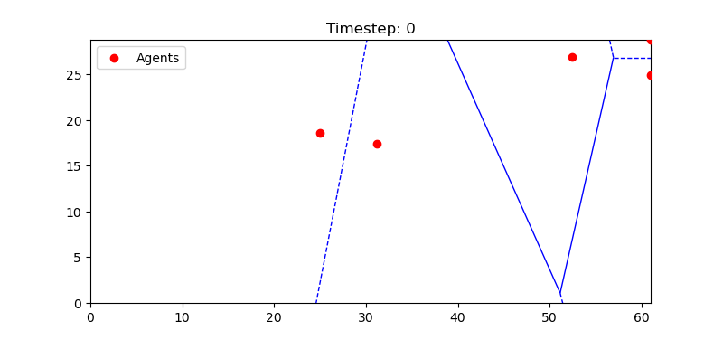

Coverage Control Python Package
================================



A Python package for coverage control using Voronoi partitions. This package provides tools to compute and visualize Voronoi diagrams, manage agent positions, and support related coverage control tasks.

Features
--------
- Generate random agent positions in a 2D space.
- Compute Voronoi partitions for a set of agents.
- Visualize Voronoi diagrams and agent positions.
- Example scripts to demonstrate usage.
- **Future Plan**: Build support for multi-robot coverage control using ROS2 Humble (coming soon).


Installation
------------
1. Clone the repository:

   ```
   git clone https://github.com/mhd-hanif/coverage-control-simulator.git
   cd coverage_control
   ```

2. Install the package using `pip`:

   ```
   pip install .
   ```

3. Alternatively, install the required dependencies:

   ```
   pip install -r requirements.txt
   ```

Usage
-----
1. Import the package in your Python script:

   ```
   from coverage_control.agents import generate_agents
   from coverage_control.voronoi import compute_voronoi
   from coverage_control.visualization import plot_voronoi
   ```

2. Run the example script:

   - Static Voronoi Example:
     ```
     python examples/example_static.py
     ```
     This script generates a Voronoi diagram for 5 agents and visualizes it.

   - Dynamic Voronoi Example:
     ```
     python examples/example_dynamic.py
     ```
     This script reads agents' positions from a CSV input and dynamically updates the Voronoi partition based on the agents' positions.

Repository Structure
--------------------
- coverage_control/: Core package code
- examples/: Example scripts for demonstration
- tests/: Unit tests for the package
- docs/: Documentation (optional)
- setup.py: Installation script
- requirements.txt: Python dependencies
- README.txt: Overview and usage instructions

Planned Features
----------------
We plan to expand this package to support multi-robot coverage control applications using ROS2 Humble. The upcoming features will focus on seamless integration with ROS2 systems and enable advanced multi-agent coordination. Stay tuned for updates!

License
-------
This project is licensed under the MIT License. See the LICENSE file for details.

Contributions
-------------
Contributions are welcome! Please check the CONTRIBUTING.md file for guidelines.

Contact
-------
For questions or suggestions, please contact me at mhaniffarhat@gmail.com.


